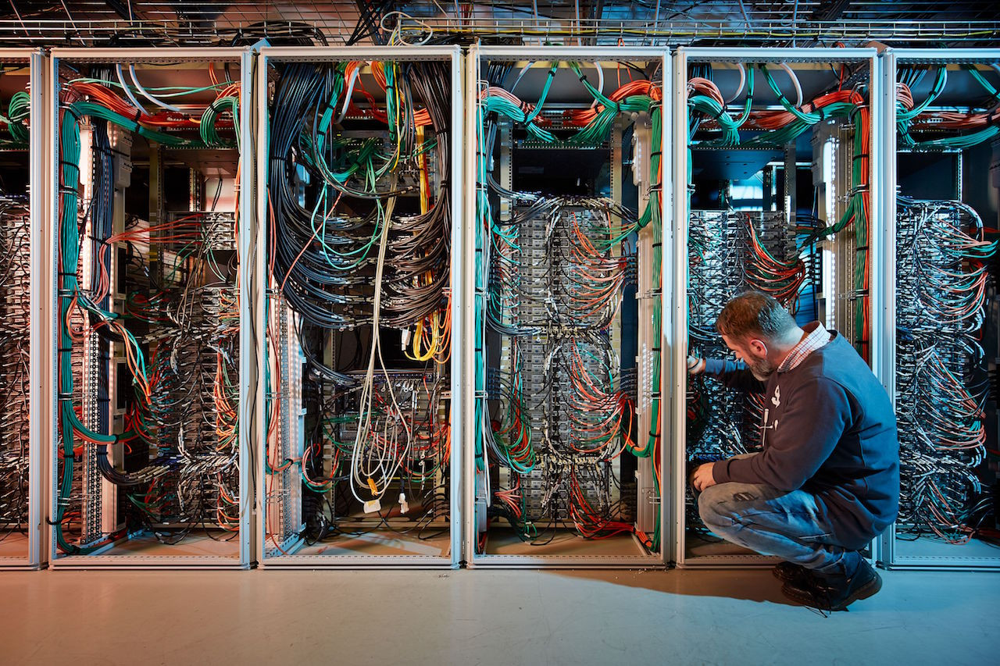
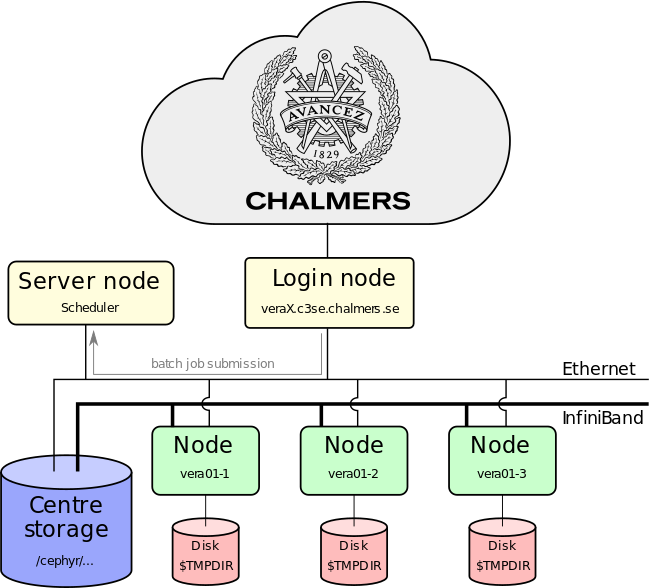
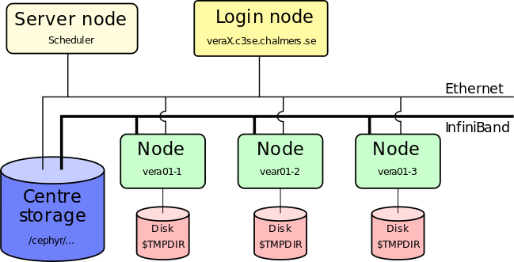
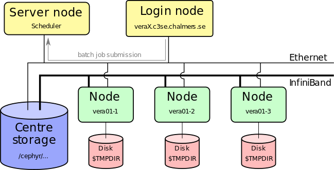
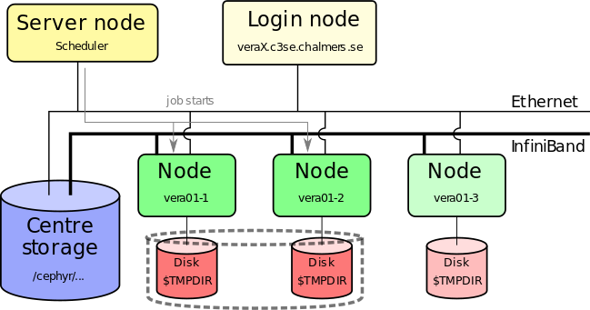

# Aims of this lecture
* Introducing HPC
    * What is a computer cluster
    * Key hardware differences against personal computers
    * User interface
* Parallel computations
    * Vector instructions
    * Shared memory
    * Distributed memory
* Submitting jobs to the queue
    * Prepare
    * Monitor
    * Profile
* Accelerators (GPUs)

# Introducing HPC

## The personal computer

* Motherboard
  * CPU
  * RAM 
  * Persistent storage (disks)
  * Network card
  * GPU card
    * VRAM
* Some of these components are somtimes incorporated

# What is a computer cluster

* Simply many computers mounted connected into a local area network LAN


* Typically rack mounted and connected with a fast network
* One node == one computer
   * From 10 to 40 per rack is common
   * Login nodes
* Associated storage cluster
   * Again just computers with many harddrives working over network

# Hardware differences

* **Typical** differences for a single node
* Enterprise hardware has support contracts and is made to be running at load nonstop for years.

## CPU
* Much more CPU cores (up to 128 are common today)
* Typically *slower* for single core work
* Often dual socket: two CPU on a single motherboard
* Larger vector instructions for floating point math (AVX512)

## Memory
* Much more (512GB and up per node is common these days)
* Error Correcting Code (ECC) memory is more reliable and can detect and random bit errors

## Network
* Faster, from 25Gbit/s to 200Gbit/s
* Infiniband, alternative to Ethernet; lower latency for communicating between computations split across nodes

## Storage
* Local disks are not used for persistent storage of user data
* Primary data access is done via a network attached storage cluster
* Storage is more reliable; protection to small hardware failures via redundant hardware (RAID) and backups
* Network storage is very sensitive to access pattern

### Note:
* Single harddrives are notoriously unreliable: you must always keep several backups of your data.
* Note that RAID does not protect you from accidentally deleting/overwriting your own data.

## GPU
* Some compute nodes don't have any GPUs
* 4 GPUs per node
* More VRAM ("video" RAM) up to 80GB
* GPUs are customized hardware for various floating point types

## GPU performance exmaple
| GPUs    | FP16 TFLOP/s | FP32 | FP64 | Capability |
|---------|--------------|------|------|------------|
| V100    |         31.3 | 15.7 |  7.8 |        7.0 |
| T4      |         65.1 |  8.1 | 0.25 |        7.5 |
| A40     |         37.4 | 37.4 | 0.58 |        8.6 |
| A100    |         77.9 | 19.5 |  9.7 |        8.0 |
| **CPU node** |         |      |      |            |
| Skylake |              | ~4   | ~2   | (32 cores) |
| Icelake |              | ~8   | ~4   | (64 cores) |

* Theoretical numbers!

# User differences

* Laptop/desktop
  * Single user
  * Administrative privileges
  * Software installed manually by user via OS or downloads
  * Just run the software directly on the computer

* Cluster
  * Multi user
  * No elevated privileges
  * Software installations 
  * Interacting with a login node, submitting jobs to queue
    * Mostly batch computations
    * Interactive jobs are possible, but there is still a queue
    * Light interactive post-processing can be done on login node

# The compute cluster


## Preparing job


* Install your own software (if needed)
* Login nodes are shared resources!
* Transfer input files to the cluster
* Prepare batch scripts for how perform your analysis


## Submit job


* Submit job script to queuing system (sbatch)
* You'll have to specify number of cores, wall-time, GPU/large memory
* Job is placed in a queue ordered by priority (influenced by usage, project size, job size)

## Job starts


* Job starts when requested nodes are available (and it is your turn)
* Automatic environment variables inform MPI how to run (which can run over Infiniband)
* Performs the actions you detailed in our job script as if you were typing them in yourself

# Connecting
* SSH: `ssh CID@vera1.c3se.chalmers.se` or `CID@vera2.c3se.chalmers.se`
* Thinlinc: <https://vera1.c3se.chalmers.se:300> or <https://vera1.c3se.chalmers.se:300>
  * Also has a dedicated client for linux, mac, windows
* OpenOndemand: <https://vera.c3se.chalmers.se>
  * Conveniently launch interactive applications in the queue
  * Also allows graphical desktop on either compute node (via queue) or login node like Thinlinc


# Parallel computations

* Moving a program to a HPC environment doesn't magically make it faster.
* Programs need to consider how to parallelize things manually.

## Embarrasingly parallel jobs
* The simplest parallelization is to simple run different the same analysis on different inputs

```bash
#!/bin/bash
#SBATCH -A C3SE2021-2-3
#SBATCH -n 1
#SBATCH -C MEM512  # my computation needs 1/64 * 512GB = 8GB of RAM per task
#SBATCH -t 1:00:00
#SBATCH --array=0-99
#SBATCH --mail-user=zapp.brannigan@chalmers.se --mail-type=end

module load SciPy-bundle

process_data.py input_data_${SLURM_ARRAY_TASK_ID}.npz results_${SLURM_ARRAY_TASK_ID}.txt
```

* Need to produce a plot or table with all the combined results? Split that into seperate postprocessing.
* Need millions of analysis? Do them in batches or look into High-Throughput-Computing software like `hyperqueue`

## Vector instructions

* All modern CPUs have some vector instruction sets allowing them to do multiple binary operations simultaenously on a single core.
* SIMD - Single Instruction Multiple Data
* AVX512 (2015) > AVX2 (2008) > AVX (2011) > SSE (1999-2006) > Generic instructions (<1996).
* Has strict requirements on memory layout.
* Most of the time one relies on optimized libraries doing the heavy lifting.
* All of Vera's CPUs support AVX512.
* You should make your code fast one a single core first!

## Shared memory

* Many programming languages can dynamically launch multiple threads to speed up computations
* Threads a lightweight processes that can be spun up extremely quickly
* Multiple threads of computation running and sharing memory
  * You have to program in that no two threads should read and write to the same memory at the same time (race condition)
  * Typical example of parallelizing a for loop with OpenMP

```c
#pragma omp parallel for
for(int i = 0; i < ARRAY_SIZE; i++) {
    results[i] = a[i] / b[i];
}
```

* Using optimized libraries can hide away this complexity and use multiple threads under the hood.
* Software using OpenMP framework can typically be controlled via environment variables like `OMP_NUM_THREADS`

## Shared memory in python
* Python itself can't do actual multithreading
  * `multiprocessing` actually starts multiple interpreters and passes messages between. They can't see the same memory.
  * Python 3.13 allows for free threading mode, though still highly experimental and support is nonexistent.
  * Libraries (`numpy` etc.) may have C/C++/Rust code that can use multiple threads internally.
* Numba can just-in-time compile multithreaded "python"

```python
from numba import njit

@njit(parallel=True)
def parallel_sum(arr):
    total = 0.0
    for i in prange(len(arr)):
        total += arr[i]
    return total
```

## Distributed memory

* Multiple individual processes all not sharing memory access.
* Messages must be explicitly passed between processes to synchronize information: Message Passing Interface (MPI) is the standard.
* Optional within a single node. Required when scaling to multiple nodes.
* Software can use both modes; MPI across nodes + OpenMP inside nodes is common.

```python
from mpi4py import MPI
import numpy as np

comm = MPI.COMM_WORLD  # Get the global communicator
rank = comm.Get_rank()  # Get the rank of the current process
size = comm.Get_size()  # Get the total number of processes

# Total size of the array
N = 100

# The root process initializes the data
if rank == 0:
    data = np.arange(N, dtype=np.float64)
    print(f"Process {rank} initializing data: {data}")
else:
    data = None

# Scatter the data: distribute chunks of the array to all processes
chunk_size = N // size
local_data = np.empty(chunk_size, dtype=np.float64)
comm.Scatter(data, local_data, root=0)

# Each process computes the sum of its local chunk
local_sum = np.sum(local_data)
print(f"Process {rank} computed local sum: {local_sum}")

# Gather the local sums at the root process
total_sum = comm.reduce(local_sum, op=MPI.SUM, root=0)

# Root process prints the total sum
if rank == 0:
    print(f"Total sum: {total_sum}")
```

## MPI is not the only option

* Everyone knows `numpy`, `scipy` and `pandas`, but consider:
  * <https://www.ray.io>
  * <https://www.dask.org>
  * <https://github.com/modin-project/modin> - drop-in parallel `pandas` replacement
  * <https://numba.pydata.org>


# Running jobs in a cluster

* Prepare your data and programs on the login node
* Prepare a jobscript
* Monitor your jobs
* Profile your application

## Jobscripts

* What Account == Project to run on
* Request a maximum walltime
* Number of tasks, cpus-per-task, gpus-per-task, cpus-per-gpu, and many other optional steps.
* Constrain jobs to a specific node type, typically larger memory nodes.
* Other types of resource tracked by SLURM like GPUs of various types.

## Jobscript example

```bash
#!/usr/bin/env bash
#SBATCH -A C3SE2024-1-2 -p vera
#SBATCH -t 1:00:00
#SBATCH -n 4

# run your program
module load SciPy-bundle/2024.05-gfbf-2024a

export OMP_NUM_THREADS=$SLURM_NTASKS
python3 compute_stuff.py
```

## Monitor your jobs

1. Check the queue: `squeue -u $USER`
   * Is it running on what you wanted?
   * If you don't see it, maybe it just finished really really quick, check the SLURM accounting database `sacct -u $USER`
2. Check the output files for errors or warnings.
3. Check the grafana page: `job_stats.py JOBID` which reveals if there are obvious bottlenecks. 

## Profile your application

* Compiled C, C++, Fortran etc. (make sure you include debug symbols)
  * Intel VTune, AMD uProf, NVIDIA Nsight
* Python
  * Scalene (and many more)
* Most of these tools are sampling your code at runtime: results are not exact and may have some overhead.
* Common bottlenecks can be
  * Disk I/O: How you read data is very important, especially on a network attached parallel filesystem!
  * Memory access: Random memory access patterns can slow down the CPU 100x. Sequential memory reads are better.
  * GPU syncs: Excessive syncing with GPUs can be much slower than the entire calculation


# Accelerators (GPUs)

* Originally made for graphics rendering but that's just lots of linear algebra.
* Typically good at FP32 and below whereas scientific computing on CPUs has generally used FP64 (double precision).
  * Newton iteration; accuracy isn't important for the tangent problem
  * Iterative problems can start with FP16 then switch to FP32, FP64 for fine tuning


* GPUs are inherently parallel-only: A100 GPU has 6912 CUDA cores!
* Requires careful planning and use to obtain good performance.
  * Sync too often and you kill any performance gain.

## Writing custom CUDA kernels

* Possile to do in many langauges: C, C++, Julia, Python (via `numba`)
* Difficulty can vary

```python
from numba import cuda

@cuda.jit
def vector_add_kernel(A, B, C):
    i = cuda.grid(1)    
    C[i] = A[i] + B[i]
```

## GPU arrays

* Simple GPU array types is offered by many frameworks in most programming languages.
* Are you used to vectorizing using numpy arrays? Almost the same thing!
* Examples <https://docs.cupy.dev/en/stable/user_guide/basic.html>

* Some libraries for python:
  * <https://github.com/rapidsai> (cuDF and many more)
  * <https://cupy.dev>
  * <https://jax.readthedocs.io>
  * <https://pytorch.org> (you could use tensors for general linear algebra)

