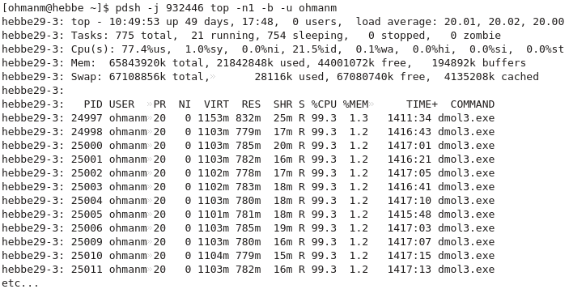
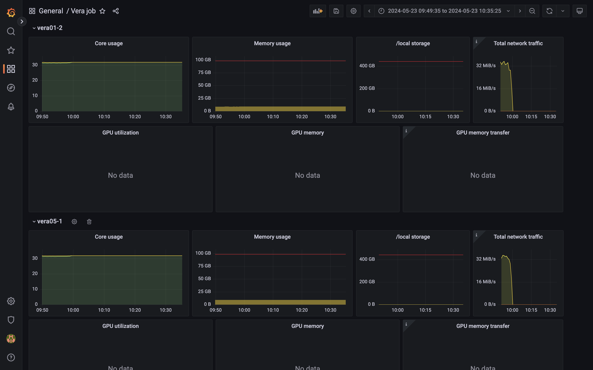
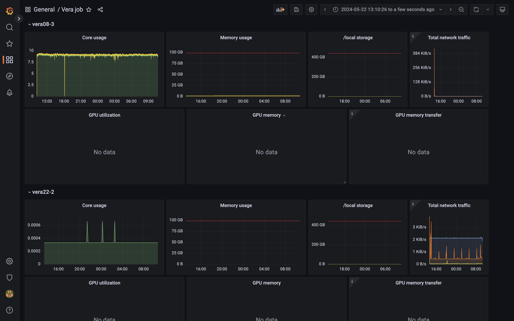
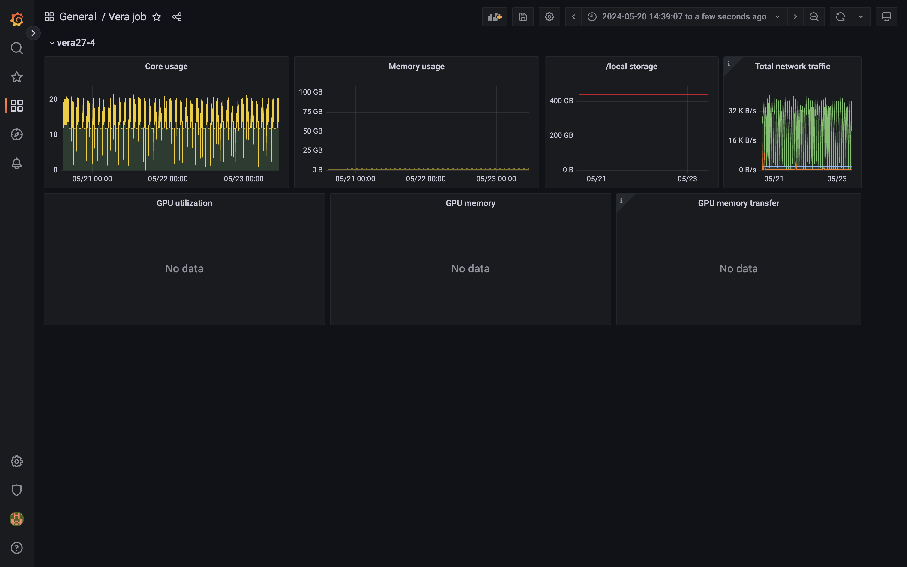

# Aims of this lecture
* Introducing HPC
    * What is a computer cluster
    * Key hardware differences against personal computers
    * User interface
* Parallel computations
    * Vector instructions
    * Shared memory
    * Distributed memory
* Submitting jobs to the queue
    * Prepare
    * Monitor
    * Profile
* Accelerators (GPUs)

# Introducing HPC

## The personal computer

* Motherboard
  * CPU
  * RAM 
  * Persistent storage (disks)
  * Network card
  * GPU card
    * VRAM
* Some of these components are somtimes incorporated

# What is a computer cluster

* Simply many computers mounted connected into a local area network LAN


* Typically rack mounted and connected with a fast network
* One node == one computer
   * From 10 to 40 per rack is common
   * Login nodes
* Associated storage cluster
   * Again just computers with many harddrives working over network

# Hardware differences

* **Typical** differences for a single node
* Enterprise hardware has support contracts and is made to be running at load nonstop for years.

## CPU
* Much more CPU cores (up to 128 are common today)
* Typically *slower* for single core work
* Often dual socket: two CPU on a single motherboard
* Larger vector instructions for floating point math (AVX512)

## Memory
* Much more (512GB and up per node is common these days)
* Error Correcting Code (ECC) memory is more reliable and can detect and random bit errors

## Network
* Faster, from 25Gbit/s to 200Gbit/s
* Infiniband, alternative to Ethernet; lower latency for communicating between computations split across nodes

## Storage
* Local disks are not used for persistent storage of user data
* Primary data access is done via a network attached storage cluster
* Storage is more reliable; protection to small hardware failures via redundant hardware (RAID) and backups
* Network storage is very sensitive to access pattern

### Note:
* Single harddrives are notoriously unreliable: you must always keep several backups of your data.
* Note that RAID does not protect you from accidentally deleting/overwriting your own data.

## GPU
* Some compute nodes don't have any GPUs
* 4 GPUs per node
* More VRAM ("video" RAM) up to 80GB
* GPUs are customized hardware for various floating point types

## GPU performance exmaple
| GPUs    | FP16 TFLOP/s | FP32 | FP64 | Capability |
|---------|--------------|------|------|------------|
| V100    |         31.3 | 15.7 |  7.8 |        7.0 |
| T4      |         65.1 |  8.1 | 0.25 |        7.5 |
| A40     |         37.4 | 37.4 | 0.58 |        8.6 |
| A100    |         77.9 | 19.5 |  9.7 |        8.0 |
| **CPU node** |         |      |      |            |
| Skylake |              | ~4   | ~2   | (32 cores) |
| Icelake |              | ~8   | ~4   | (64 cores) |

* Theoretical numbers!

# User differences

* Laptop/desktop
  * Single user
  * Administrative privileges
  * Software installed manually by user via OS or downloads
  * Just run the software directly on the computer

* Cluster
  * Multi user
  * No elevated privileges
  * Software installations 
  * Interacting with a login node, submitting jobs to queue
    * Mostly batch computations
    * Interactive jobs are possible, but there is still a queue
    * Light interactive post-processing can be done on login node

# The compute cluster


## Preparing job


* Install your own software (if needed)
* Login nodes are shared resources!
* Transfer input files to the cluster
* Prepare batch scripts for how perform your analysis


## Submit job


* Submit job script to queuing system (sbatch)
* You'll have to specify number of cores, wall-time, GPU/large memory
* Job is placed in a queue ordered by priority (influenced by usage, project size, job size)

## Job starts


* Job starts when requested nodes are available (and it is your turn)
* Automatic environment variables inform MPI how to run (which can run over Infiniband)
* Performs the actions you detailed in our job script as if you were typing them in yourself

# Connecting
* SSH: `ssh CID@vera1.c3se.chalmers.se` or `CID@vera2.c3se.chalmers.se`
* Thinlinc: <https://vera1.c3se.chalmers.se:300> or <https://vera1.c3se.chalmers.se:300>
  * Also has a dedicated client for linux, mac, windows
* OpenOndemand: <https://vera.c3se.chalmers.se>
  * Conveniently launch interactive applications in the queue
  * Also allows graphical desktop on either compute node (via queue) or login node like Thinlinc


# Parallel computations

* Moving a program to a HPC environment doesn't magically make it faster.
* Programs need to consider how to parallelize things manually.

## Embarrasingly parallel jobs
* The simplest parallelization is to simple run different the same analysis on different inputs
* Submitted with `sbatch --array=0-99 bunch_of_scripts.sh`

```bash
#!/bin/bash
#SBATCH -A C3SE2021-2-3
#SBATCH -n 1
#SBATCH -C MEM512  # my computation needs 1/64 * 512GB = 8GB of RAM per task
#SBATCH -t 1:00:00
#SBATCH --array=0-99
#SBATCH --mail-user=zapp.brannigan@chalmers.se --mail-type=end

module load SciPy-bundle

process_data.py input_data_${SLURM_ARRAY_TASK_ID}.npz results_${SLURM_ARRAY_TASK_ID}.txt
```

* Need to produce a plot or table with all the combined results? Split that into seperate postprocessing.
* Need millions of analysis? Do them in batches or look into High-Throughput-Computing software like `hyperqueue`

## Vector instructions

* All modern CPUs have some vector instruction sets allowing them to do multiple binary operations simultaenously on a single core.
* SIMD - Single Instruction Multiple Data
* AVX512 (2015) > AVX2 (2008) > AVX (2011) > SSE (1999-2006) > Generic instructions (<1996).
* Has strict requirements on memory layout.
* Most of the time one relies on optimized libraries doing the heavy lifting.
* All of Vera's CPUs support AVX512.
* You should make your code fast one a single core first!

## Shared memory

* Many programming languages can dynamically launch multiple threads to speed up computations
* Multiple threads of computation running and sharing memory
  * You have to program in that no two threads should read and write to the same memory at the same time (race condition)
  * Typical example of parallelizing a for loop with OpenMP

```c
#pragma omp parallel for
for(int i = 0; i < ARRAY_SIZE; i++) {
    results[i] = a[i] / b[i];
}
```

* Using optimized libraries can hide away this complexity and use multiple threads under the hood.
* Software using OpenMP framework can typically be controlled via environment variables like `OMP_NUM_THREADS`

## Shared memory in python
* Python itself can't do actual multithreading
  * `multiprocessing` actually starts multiple interpreters and passes messages between. They can't see the same memory.
  * Python 3.13 allows for free threading mode, though still highly experimental and support is nonexistent.
  * Libraries (`numpy` etc.) may have C/C++/Rust code that can use multiple threads internally.

## Distributed memory

* Multiple individual processes all not sharing memory access.
* Messages must be explicitly passed between processes to synchronize information: Message Passing Interface (MPI) is the standard.
* Optional within a single node. Required when scaling to multiple nodes.
* Software can use both modes; MPI across nodes + OpenMP inside nodes is common.

```python
from mpi4py import MPI
import numpy as np

comm = MPI.COMM_WORLD  # Get the global communicator
rank = comm.Get_rank()  # Get the rank of the current process
size = comm.Get_size()  # Get the total number of processes

# Total size of the array
N = 100

# The root process initializes the data
if rank == 0:
    data = np.arange(N, dtype=np.float64)
    print(f"Process {rank} initializing data: {data}")
else:
    data = None

# Scatter the data: distribute chunks of the array to all processes
chunk_size = N // size
local_data = np.empty(chunk_size, dtype=np.float64)
comm.Scatter(data, local_data, root=0)

# Each process computes the sum of its local chunk
local_sum = np.sum(local_data)
print(f"Process {rank} computed local sum: {local_sum}")

# Gather the local sums at the root process
total_sum = comm.reduce(local_sum, op=MPI.SUM, root=0)

# Root process prints the total sum
if rank == 0:
    print(f"Total sum: {total_sum}")
```

## Noteworthy python frameworks

* Everyone knows `numpy`, `scipy` and `pandas`, but consider:
  * <https://www.ray.io>
  * <https://www.dask.org>
  * <https://github.com/modin-project/modin> - drop-in parallel `pandas` replacement
  * <https://numba.pydata.org>


# Running jobs in a cluster

* Prepare your data and programs on the login node
* Prepare a jobscript
* Monitor your jobs
* Profile your application

## Jobscripts

TODO

## Monitor your jobs

1. Check the queue: `squeue -u $USER`
   * Is it running on what you wanted?
   * If you don't see it, maybe it just finished really really quick, check the SLURM accounting database `sacct -u $USER`
2. Check the output files for errors or warnings.
3. Check the grafana page: `job_stats.py JOBID` which reveals if there are obvious bottlenecks. 

## Profile your application

* Compiled C, C++, Fortran etc. (make sure you include debug symbols)
  * Intel VTune, AMD uProf, NVIDIA Nsight
* Python
  * Scalene (and many more)
* Most of these tools are sampling your code at runtime: results are not exact and may have some overhead.
* Common bottlenecks can be
  * Disk I/O: How you read data is very important, especially on a network attached parallel filesystem!
  * Memory access: Random memory access patterns can slow down the CPU 100x. Sequential memory reads are better.
  * GPU syncs: Excessive syncing with GPUs can be much slower than the entire calculation


# Accelerators (GPUs)

* Originally made for graphics rendering.
* Typically good at FP32 and below whereas scientific computing on CPUs has generally used FP64 (double precision).
  * Newton iteration; accuracy isn't important for the tangent problem
  * Iterative problems can start with FP16 then switch to FP32, FP64 for fine tuning


* GPUs are inherently parallel-only: A100 GPU has 6912 CUDA cores!
* Requires careful planning and use to obtain good performance.
  * Sync too often and you kill any performance gain.

## Writing custom CUDA kernels

* Possile to do in many langauges: C, C++, Julia, Python (via `numba`)
* Difficulty can vary

```python
from numba import cuda

@cuda.jit
def vector_add_kernel(A, B, C):
    i = cuda.grid(1)    
    C[i] = A[i] + B[i]
```

## GPU arrays

* Simple GPU array types is offered by many frameworks in most programming languages.
* Are you used to vectorizing using numpy arrays? Almost the same thing!
* Examples <https://docs.cupy.dev/en/stable/user_guide/basic.html>

* Some libraries:
  * <https://github.com/rapidsai/cudf> (RAPIDS)
  * <https://cupy.dev/>
  * <https://pytorch.org> (you could use tensors for general linear algebra)

------------------------------------------------------------------

* Don't load modules in your `~/.bashrc`. You will break things like the desktop. Load modules in each jobscript to make them self contained, otherwise it's impossible for us to offer support.


# Modules (continued)
* Toolchains
    * **Compilers**, C, C++, and FORTRAN compilers such as ifort, gcc, clang
    * **MPI-implementations**, such as Intel-mpi, OpenMPI 
    * **Math Kernel Libraries**, optimised BLAS and FFT (and more) e.g. mkl
* Large number of software modules;
  Python (+a lot of addons such as NumPy, SciPy etc), ANSYS, COMSOL, Gaussian, Gromacs, MATLAB, OpenFoam, R, StarCCM, etc.
* **module load module-name** - load a module
* **module list** - list currently loaded modules
* **module keyword string** - search keyword string in modules (e.g. extensions)
* **module spider module-name** - search for module
* **module purge** - unloads all current modules
* module show module-name - shows the module content
* module avail - show available modules (for currently loaded toolchain only)
* module unload module-name - unloads a module


# Modules (continued)
* A lot of software available in [modules](/documentation/modules/).
* Commercial software and libraries; MATLAB, Mathematica, Schrodinger, CUDA, Nsight Compute and much more.
* Tools, compilers, MPI, math libraries, etc.
* Major version update of all software versions is done twice yearly
* Overview of [recent toolchains](/documentation/modules/#recent-toolchains)
* Mixing toolchains versions will not work
* Popular top level applications such as TensorFlow and PyTorch may be updated within a single toolchain version.


# Software - Python
* We install the fundamental Python packages for HPC, such as NumPy, SciPy, PyTorch, optimised for our systems
* We can also install Python packages if there will be several users.
* We provide `virtualenv`, `apptainer`, `conda` (least preferable) so you can install your own Python packages locally.
  <https://www.c3se.chalmers.se/documentation/applications/python/>
* Avoid using the old OS installed Python.
* Avoid installing python packages directly into home directory with `pip install --user`. They will leak into containers and other environments, and will quickly eat up your quota.


# Software - Installing software
* You are ultimately responsible for having the software you need
* You are also responsible for having any required licenses
* We're happy to help you installing software - ask us if you're unsure of what compiler or maths library to use, for example.
* We can also install software centrally, if there will be multiple users, or if the software requires special permissions. You must supply us with the installation material (if not openly available).
* If the software already has configurations in [EasyBuild](https://github.com/easybuilders/easybuild-easyconfigs/) then installations can be very quick.
* You can run your own [containers](/documentation/applications/containers/).


# Software - Building software
* Use modules for build tools things
    * buildenv modules, e.g. `buildenv/default-foss-2023a-CUDA-12.1.1` provides a build environment with GCC, OpenMPI, OpenBLAS, CUDA
    * many important tools: `CMake`, `Autotools`, `git`, ...
    * and much more `Python`, `Perl`, `Rust`, ...
* You can link against libraries from the module tree. Modules set `LIBRARY_PATH` and other environment variables and more which can often be automatically picked up by good build systems.
* Poor build tools can often be "nudged" to find the libraries with configuration flags like `--with-python=$EBROOTPYTHON`
* You can only install software in your allocated disk spaces (nice build tools allows you to specify a `--prefix=path_to_local_install`)
    * Many "installation instructions" online falsely suggest you should use `sudo` to perform steps. They are wrong.
* Need a common dependency? You can request we install it as another module.


# Building containers
* Simply `apptainer build my.sif my.def` from a given definition file, e.g:

```
Bootstrap: docker
From: continuumio/miniconda3:4.12.0

%files
    requirements.txt

%post
    /opt/conda/bin/conda install -y --file requirements.txt
```

* You can boostrap much faster from existing containers (even your own) if you want to add things:

```
Bootstrap: localimage
From: path/to/existing/container.sif

%post
    /opt/conda/bin/conda install -y matplotlib
```

* Final image is small portable single file. 
* More things can be added to the definition file e.g. `%environment`


# Storing data
* Home directories
    * `$HOME = /cephyr/users/<CID>/Vera`
    * `$HOME = /cephyr/users/<CID>/Alvis`
* The home directory is backed up every night 
* We use quota to limit storage use
* To check your current quota on all your active storage areas, run `C3SE_quota`
* Quota limits (*Cephyr*):
    * User home directory (`/cephyr/users/<CID>/`)
        * 30GB, 60k files
    * Use `where-are-my-files` to find file quota on Cephyr.
* <https://www.c3se.chalmers.se/documentation/filesystem/>


# Storing data
* If you need to store more data, you can apply for a [storage project](https://supr.naiss.se/round/storage/)
* `$SLURM_SUBMIT_DIR` is defined in jobs, and points to where you submitted your job.
* Try to avoid lots of small files: sqlite or HDF5 are easy to use!
* [Data deletion policy](https://www.naiss.se/policies/project-ends/) for storage projects.
* See [NAISS UA](https://supr.naiss.se/public/user_agreement/) for user data deletion.


# Storing data - TMPDIR
* `$TMPDIR`: local scratch disk on the node(s) of your jobs. Automatically deleted when the job has finished.
* When should you use `$TMPDIR`?
    * The only good reason NOT to use `$TMPDIR` is if your program only loads data in one read operation, processes it, and writes the output.
* It is crucial that you use `$TMPDIR` for jobs that perform intensive file I/O
* If you're unsure what your program does: investigate it, or use `$TMPDIR`!
* Using `/cephyr/...` or `/mimer/...` means the network-attached permanent storage is used.
* Using `sbatch --gres=ptmpdir:1` you get a distributed, parallel `$TMPDIR` across all nodes in your job. Always recommended for multi-node jobs that use $TMPDIR.


# Your projects
* `projinfo` lists your projects and current usage. `projinfo -D` breaks down usage day-by-day (up to 30 days back).

```text
 Project            Used[h]      Allocated[h]     Queue
    User
-------------------------------------------------------
C3SE2017-1-8       15227.88*            10000      vera
    razanica       10807.00*
    kjellm          2176.64*
    robina          2035.88* <-- star means we are over 100% usage
    dawu             150.59*     which means this project has lowered priority
    framby            40.76*
-------------------------------------------------------
C3SE507-15-6        9035.27             28000       mob
    knutan          5298.46
    robina          3519.03
    kjellm           210.91
    ohmanm             4.84
```

# Running jobs
* On compute clusters jobs must be submitted to a queuing system that starts your jobs on the compute nodes: 
    * `sbatch <arguments> script.sh`
* Simulations must NOT run on the login nodes. Prepare your work on the front-end, and then submit it to the cluster
* A job is described by a script (script.sh above) that is passed on to the queuing system by the sbatch command
* Arguments to the queue system can be given in the `script.sh` as well as on the command line
* Maximum wall time is 7 days (we *might* extend it manually in rare occasions)
    * Anything long running should use checkpointing of some sort to save partial results.
* When you allocate less than a full node, you are assigned a proportional part of the node's memory and local disk space as well.
* See <https://www.c3se.chalmers.se/documentation/running_jobs>


# Running jobs on Vera
* `-C MEM96` requests a 96GB node - 168 (skylake) total (some private)
* `-C MEM192` requests a 192GB node - 17 (skylake) total (**all** private)
* `-C MEM384` requests a 384GB node - 7 (skylake) total (5 private, 2 GPU nodes)
* `-C MEM512` requests a 512GB node - 20 (icelake) total (6 GPU nodes)
* `-C MEM768` requests a 768GB node - 2 (skylake) total
* `-C MEM1024` requests a 1024GB node - 9 (icelake) total (3 private)
* `-C MEM2048` requests a 2048GB node - 3 (icelake) total (**all** private)
* `-C 25G` requests a (skylake) node with 25Gbit/s storage and internet connection (nodes without 25G still uses fast Infiniband for access to `/cephyr`).
* `--gpus-per-node=T4:1` requests 1 T4
* `--gpus-per-node=V100:2` requests 2 V100
* `--gpus-per-node=A40:4` requests 4 A40
* `--gpus-per-node=A100:4` requests 4 A100
* Don't specify constraints (`-C`) unless you know you need them.


# Job cost on Vera

* On Vera, jobs cost based on the number of physical cores they allocate, plus

| Type      | VRAM | Additional cost |
|-----------|------|-----------------|
| T4        | 16GB |               6 |
| A40       | 48GB |              16 |
| V100      | 32GB |              20 |
| A100      | 40GB |              48 |

* Example: A job using a full node with a single T4 for 10 hours: `(32 + 6) * 10 = 380` core hours
* Note: 16, 32, and 64 bit floating point performance differ greatly between these specialized GPUs. Pick the one most efficient for your application.
* Additional running cost is based on the price compared to a CPU node.
* You don't pay any extra for selecting a node with more memory; but you are typically competing for less available hardware.
* GPUs are cheap compared to CPUs in regard to their performance


# Running on Icelake vs Skylake
* If specific memory or GPU model, there are only currently one option for the CPU, and the job will automatically end up using that.
* Skylake (32 cores per node):
    * `MEM96`, `MEM192`, `MEM384`, `MEM768`, `25G`, or T4, V100 gpus
* Icelake (64 cores per node):
    * `MEM512`, `MEM1024`, `MEM2048`, or A40, A100 gpus
* You can explicitly request either node type with `-C SKYLAKE` and `-C ICELAKE`.
* If you don't specify any constraint, you will be automatically assigned `-C SKYLAKE` (for now).
* You can use `-C "SKYLAKE|ICELAKE"` to opt into using either node type. Note the differing core count, so you want to use this with care!


# Viewing available nodes

* `jobinfo -p vera` command shows the current state of nodes in the main partition

```text
Node type usage on main partition:
TYPE                  ALLOCATED       IDLE    OFFLINE      TOTAL
ICELAKE,MEM1024               4          2          0          6
ICELAKE,MEM512               13          0          0         13
SKYLAKE,MEM192               17          0          0         17
SKYLAKE,MEM768                2          0          0          2
SKYLAKE,MEM96,25G            16          0          4         20
SKYLAKE,MEM96               172          0          4        176

Total GPU usage:
TYPE    ALLOCATED IDLE OFFLINE TOTAL
A100            8    4       0    12
V100            4    4       0     8
T4              7    1       0     8
A40             0   16       0    16
```
 

# Vera script example

```bash
#!/bin/bash
#SBATCH -A C3SE2021-2-3 -p vera
#SBATCH -C SKYLAKE
#SBATCH -n 64
#SBATCH -t 2-00:00:00
#SBATCH --gres=ptmpdir:1

module load ABAQUS/2022-hotfix-2223 intel/2022a
cp train_break.inp $TMPDIR
cd $TMPDIR

abaqus cpus=$SLURM_NTASKS mp_mode=mpi job=train_break

cp train_break.odb $SLURM_SUBMIT_DIR
```


# Vera script example

```bash
#!/bin/bash
#SBATCH -A C3SE2021-2-3 -p vera
#SBATCH -t 2-00:00:00
#SBATCH --gpus-per-node=V100:1

unzip many_tiny_files_dataset.zip -d $TMPDIR/
apptainer exec --nv ~/tensorflow-2.1.0.sif python trainer.py --training_input=$TMPDIR/
```
More on [containers](https://www.c3se.chalmers.se/documentation/applications/containers/)


# Vera script example
* Submitted with `sbatch --array=0-99 wind_turbine.sh`

```bash
#!/bin/bash
#SBATCH -A C3SE2021-2-3
#SBATCH -n 1
#SBATCH -C "ICELAKE|SKYLAKE"
#SBATCH -t 15:00:00
#SBATCH --mail-user=zapp.brannigan@chalmers.se --mail-type=end

module load MATLAB
cp wind_load_$SLURM_ARRAY_TASK_ID.mat $TMPDIR/wind_load.mat
cp wind_turbine.m $TMPDIR
cd $TMPDIR
RunMatlab.sh -f wind_turbine.m
cp out.mat $SLURM_SUBMIT_DIR/out_$SLURM_ARRAY_TASK_ID.mat
```

* Environment variables like `$SLURM_ARRAY_TASK_ID` can also be accessed from within all programming languages, e.g:

```matlab
array_id = getenv('SLURM_ARRAY_TASK_ID'); % matlab
```

```python
array_id = os.getenv('SLURM_ARRAY_TASK_ID') # python
```


# Vera script example
* Submitted with `sbatch --array=0-50:5 diffusion.sh`

```bash
#!/bin/bash
#SBATCH -A C3SE2021-2-3
#SBATCH -C ICELAKE
#SBATCH -n 128 -t 2-00:00:00

module load intel/2022a
# Set up new folder, copy the input file there
temperature=$SLURM_ARRAY_TASK_ID
dir=temp_$temperature
mkdir $dir; cd $dir
cp $HOME/base_input.in input.in
# Set the temperature in the input file:
sed -i 's/TEMPERATURE_PLACEHOLDER/$temperature' input.in

mpirun $HOME/software/my_md_tool -f input.in
```

Here, the array index is used directly as input.
If it turns out that 50 degrees was insufficient, then we could do another run:
```bash
sbatch --array=55-80:5 diffusion.sh
```

# Vera script example
Submitted with: `sbatch run_oofem.sh`

```bash
#!/bin/bash
#SBATCH -A C3SE507-15-6 -p mob
#SBATCH --ntasks-per-node=32 -N 3
#SBATCH -J residual_stress
#SBATCH -t 6-00:00:00
#SBATCH --gres=ptmpdir:1

module load PETSc
cp $SLURM_JOB_NAME.in $TMPDIR
cd $TMPDIR
mkdir $SLURM_SUBMIT_DIR/$SLURM_JOB_NAME
while sleep 1h; do
  rsync -a *.vtu $SLURM_SUBMIT_DIR/$SLURM_JOB_NAME
done &
LOOPPID=$!

mpirun $HOME/bin/oofem -p -f "$SLURM_JOB_NAME.in"
kill $LOOPPID
rsync -a *.vtu $SLURM_SUBMIT_DIR/$SLURM_JOBNAME/
```


# GPU example

```bash
#!/bin/bash
#SBATCH -A C3SE2021-2-3
#SBATCH -t 2-00:00:00
#SBATCH --gpu-per-node=A40:2

apptainer exec --nv tensorflow-2.1.0.sif python cat_recognizer.py
```


# Interactive use

You are allowed to use the Thinlinc machines for light/moderate tasks that require interactive input.
If you need all cores, or load for a extended duration, you must run on the nodes:

```bash
srun -A C3SE2021-2-3 -n 4 -t 00:30:00 --pty bash -is
```

you are *eventually* presented with a shell on the node:

```text
[ohmanm@vera12-3]#
```

* Useful for debugging a job-script, application problems, extremely long compilations.
* Not useful when there is a long queue (you still have to wait), but can be used with private partitions.
* `srun` interactive jobs will be aborted if the login node needs to be rebooted or loss of internet connectivity. Prefer always using the portal.


# Job command overview
* `sbatch`: submit batch jobs
* `srun`: submit interactive jobs
* `jobinfo`, `squeue`: view the job-queue and the state of jobs in queue
* `scontrol show job <jobid>`: show details about job, including reasons why it's pending
* `sprio`: show all your pending jobs and their priority
* `scancel`: cancel a running or pending job
* `sinfo`: show status for the partitions (queues): how many nodes are free, how many are down, busy, etc.
* `sacct`: show scheduling information about past jobs
* `projinfo`: show the projects you belong to, including monthly allocation and usage
* For details, refer to the -h flag, man pages, or google!


# Job monitoring
* Why am I queued? `jobinfo -u $USER`:
    * Priority: Waiting for other queued jobs with higher priority.
    * Resources: Waiting for sufficient resources to be free.
    * AssocGrpBillingRunMinutes: We limit how much you can have running at once (<= 100% of 30-day allocation * 0.5^x where x is the number of stars in `projinfo`).
* You can log on to the nodes that your job got allocated by using ssh (from the login node) as long as your job is running. There you can check what your job is doing, using normal Linux commands - ps, top, etc.
    * top will show you how much CPU your process is using, how much memory, and more.
      Tip: press 'H' to make top show all threads separately, for multithreaded programs
    * iotop can show you how much your processes are reading and writing on disk
* Performance benchmarking with e.g. Nvidia Nsight compute
* Debugging with gdb, Address Sanitizer, or Valgrind


# Job monitoring
* Running top on your job's nodes:




# System monitoring
* `job_stats.py JOBID` is essential.
    * Check e.g. memory usage, user, system, and wait CPU utilisation, disk usage, etc
* `sinfo -Rl` command shows how many nodes are down for repair.


# System monitoring


* The ideal job, high CPU utilisation and no disk I/O


# System monitoring


* Looks like something tried to use 2 nodes incorrectly.
* Requested for 64 cores but only used 9 of them. One node was just idling.


# System monitoring


* CPU utilisation fluctuate with network. Perhaps inefficient I/O caused by reading many small files from `/cephyr`.

# Profiling
* With the right tools you can easily dive into where your code bottlenecks are, we recommend:
  * TensorFlow: [TensorBoard](/documentation/applications/tensorboard)
  * PyTorch: `torch.profiler` (possibly with TensorBoard)
  * Python: [Scalene](/documentation/profiling)
  * Compiled CPU or GPU code: [NVIDIA Nsight Systems](/documentation/profiling)
  * MATLAB: Built in profiler
* Tools can be used interactively on compute nodes with OpenOndemand portals!

# Things to keep in mind
* Never run (big or long) jobs on the login node! If you do, we will kill the processes.
  If you keep doing it, we'll throw you out and block you from logging in for a while!
  Prepare your job, do tests and check that everything's OK before submitting the job, but don't run the job there!
* The Open Ondemand portals allow interactive desktop and web apps directly on the compute nodes. Use this for heavy interactive work.
* If your home dir runs out of quota or you put to much experimental stuff in your `.bashrc` file, expect things like the desktop session to break. Many support tickets are answered by simply clearing these out.
* Keep an eye on what's going on - use normal Linux tools on the login node and on the allocated nodes to check CPU, memory and network usage, etc. Especially for new jobscripts/codes! Do check `job_stats.py`!
* Think about what you do - if you by mistake copy very large files back and forth you can slow the storage servers or network to a crawl


